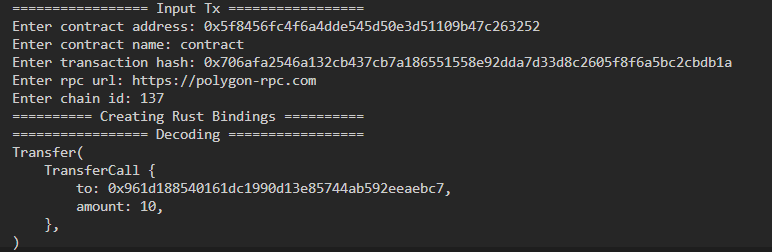

# tx-decoder through tx hash and abi
A simple transaction decoder to decode your transaction function call (calldata) using contract abi and transaction hash
## Example
### Input
```rust
    contract_address = "0x5f8456fc4f6a4dde545d50e3d51109b47c263252"
    contract_name = "contract"
    tx_hash_str = "0x706afa2546a132cb437cb7a186551558e92dda7d33d8c2605f8f6a5bc2cbdb1a"
    rpc = "https://polygon-rpc.com"
    chain_id = 137
```
### Output
```solidity
Transfer(
    TransferCall {
        to: 0x961d188540161dc1990d13e85744ab592eeaebc7,
        amount: 10,
    },
)
```
## Quick Start
- Replace current ABI with your contracts ABI (in `src/abi.json`).
- Run: `cargo run`.

